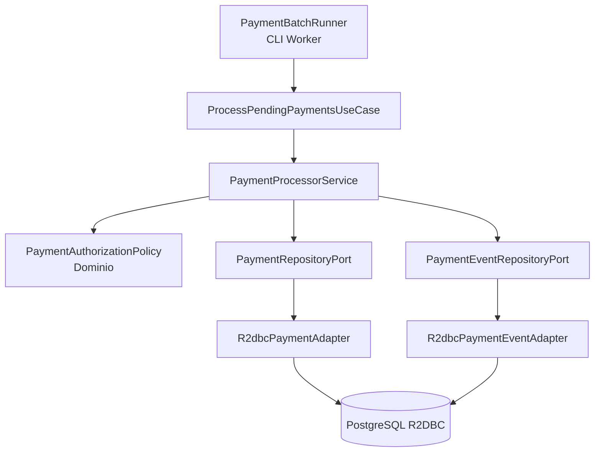

# PoC Reactor Only Payment Processing

PoC en Java 25 que demuestra uso de Reactor Core sin WebFlux para un escenario recomendado: procesamiento asíncrono/batch de pagos pendientes. No expone endpoints REST; funciona como worker reactivo que lee pagos desde PostgreSQL mediante R2DBC, procesa reglas de autorización, controla concurrencia, usa backpressure, reintentos y persiste eventos de dominio.

## ¿Vale la pena Reactor sin WebFlux?

Sí, cuando el problema no es exponer HTTP reactivo sino construir pipelines no bloqueantes: jobs batch, workers, consumo de eventos, ETL ligero, conciliaciones, procesamiento de pagos, integración con colas o flujos internos. Para APIs HTTP, WebFlux sería la capa web natural; para workers, Reactor puede usarse directamente.

## Stack

- Java 25
- Spring Boot 4.0.0
- Reactor Core
- Spring Data R2DBC
- PostgreSQL reactivo vía R2DBC
- Docker Compose
- Maven

## Funcionalidad

El worker consulta pagos en estado `PENDING`, los procesa con una política de autorización de dominio y actualiza su estado:

- `AUTHORIZED` para pagos aceptados.
- `REJECTED` si el monto supera el umbral de riesgo de la PoC.
- `FAILED` si ocurre un error no recuperable.

También registra eventos en `payment_events` como `PAYMENT_AUTHORIZED` o `PAYMENT_REJECTED`.

## Estructura del proyecto

```text
reactor-only-payment-poc/
├── infraestructura/
│   └── docker/
│       └── docker-compose.yml
├── datasets/
│   ├── schema.sql
│   └── seed-payments.sql
├── requests/
│   └── reactor-cli.md
├── src/main/java/com/edgarrt/reactoronlypayment/
│   ├── domain/
│   │   ├── model/
│   │   └── service/
│   ├── application/
│   │   ├── ports/in/
│   │   ├── ports/out/
│   │   └── usecase/
│   └── infrastructure/
│       ├── config/
│       ├── persistence/
│       └── runner/
└── src/main/resources/application.yml
```

## Arquitectura



## Código principal

### PaymentBatchRunner

Arranca un flujo periódico usando `Flux.interval`. No hay WebFlux ni servidor HTTP.

```java
Flux.interval(Duration.ZERO, Duration.ofSeconds(pollSeconds))
  .concatMap(tick -> useCase.processPendingPayments().collectList())
  .subscribe();
```

### PaymentProcessorService

Demuestra operadores centrales de Reactor:

```java
repository.findPending(batchSize)
  .limitRate(limitRate)
  .flatMap(this::processOne, concurrency)
  .onBackpressureBuffer(batchSize * 2)
  .retryWhen(Retry.backoff(maxRetries, Duration.ofMillis(200)))
```

### PaymentAuthorizationPolicy

Regla de dominio pura que devuelve `Mono<Payment>` para integrarse con el pipeline reactivo.

```java
return Mono.just(payment)
  .map(Payment::markProcessing)
  .flatMap(p -> p.amount().compareTo(new BigDecimal("500.00")) > 0
    ? Mono.just(p.reject("Amount exceeds PoC risk threshold"))
    : Mono.just(p.authorize()));
```

## Levantar infraestructura

```bash
cd infraestructura/docker
docker compose up -d
```

Esto crea PostgreSQL y precarga datos desde la carpeta `datasets`.

## Ejecutar la aplicación

Desde la raíz del proyecto:

```bash
mvn spring-boot:run
```

La aplicación corre como worker y procesa pagos cada 10 segundos.

## Validar datos

```bash
docker exec -it reactor-only-payment-postgres psql -U payments -d paymentsdb -c "select id, amount, status, attempts, failure_reason from payments order by created_at;"
```

```bash
docker exec -it reactor-only-payment-postgres psql -U payments -d paymentsdb -c "select payment_id, event_type, payload from payment_events order by created_at;"
```

## Diferencias frente a WebFlux + Reactor

| Tema | Reactor Only | WebFlux + Reactor |
|---|---|---|
| Propósito | Pipelines, workers, batch, eventos | APIs HTTP reactivas |
| Entrada | CLI, scheduler, cola, archivo, stream | Endpoint REST, SSE, WebSocket |
| Servidor HTTP | No | Sí |
| Tipos principales | `Mono`, `Flux` | `Mono`, `Flux` + controllers/router functions |
| Mejor caso de uso | Procesamiento interno no bloqueante | Microservicio REST reactivo |
| Complejidad | Menor si no necesitas HTTP | Mayor, pero necesario para APIs |

## Features Reactor demostrados

- `Mono` para operaciones unitarias.
- `Flux` para flujos de pagos.
- `flatMap(..., concurrency)` para concurrencia controlada.
- `limitRate` para control de demanda.
- `onBackpressureBuffer` para backpressure.
- `retryWhen` con backoff.
- `onErrorResume` para fallback.
- `delayElement` para simular integración externa no bloqueante.
- Programación funcional con transformaciones encadenadas.
- Persistencia reactiva con R2DBC.

## Importar en IntelliJ IDEA

1. Descomprime el ZIP.
2. Abre IntelliJ IDEA.
3. Selecciona `Open` y elige la carpeta del proyecto.
4. Espera a que Maven descargue dependencias.
5. Configura JDK 25.
6. Levanta Docker Compose.
7. Ejecuta `ReactorOnlyPaymentApplication`.
