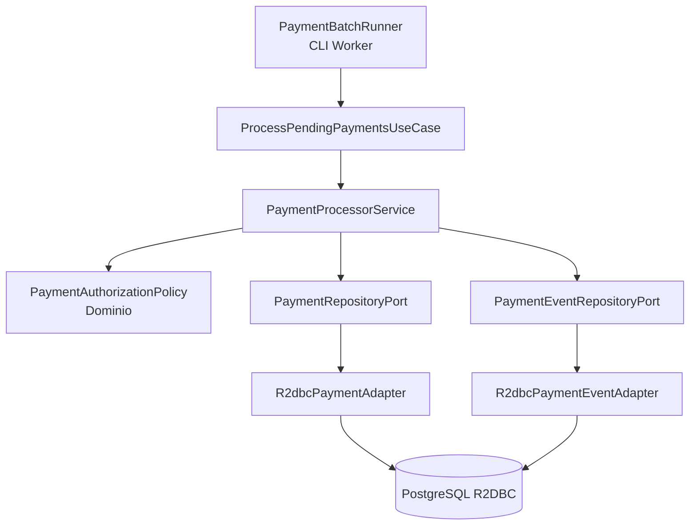

# PoC Reactor Only Payment Processing

PoC en Java 25 que demuestra uso de Reactor Core sin WebFlux para un escenario recomendado: procesamiento asíncrono/batch de pagos pendientes. No expone endpoints REST; funciona como worker reactivo que lee pagos desde PostgreSQL mediante R2DBC, procesa reglas de autorización, controla concurrencia, usa backpressure, reintentos y persiste eventos de dominio.

## Casos de uso de reactor sin webflux

Cuando el problema no es exponer HTTP reactivo sino construir pipelines no bloqueantes: jobs batch, workers, consumo de eventos, ETL ligero, conciliaciones, procesamiento de pagos, integración con colas o flujos internos. Para APIs HTTP, WebFlux sería la capa web natural; para workers, Reactor puede usarse directamente.

## Stack

- Java 25
- Spring Boot 4.0.0
- Reactor Core
- Spring Data R2DBC
- PostgreSQL reactivo vía R2DBC
- Docker Compose
- Maven

## Funcionalidad

El worker consulta pagos en estado `PENDING`, los procesa con una política de autorización de dominio y actualiza su estado:

- `AUTHORIZED` para pagos aceptados.
- `REJECTED` si el monto supera el umbral de riesgo de la PoC.
- `FAILED` si ocurre un error no recuperable.

También registra eventos en `payment_events` como `PAYMENT_AUTHORIZED` o `PAYMENT_REJECTED`.

## Estructura del proyecto

```text
reactor-only-payment-poc/
├── infraestructura/
│   └── docker/
│       ├── docker-compose.yml
│       ├── datasets/
│       │   ├── schema.sql
│       │   └── seed-payments.sql
│       └── requests/
│           └── reactor-cli.md
├── src/main/java/com/edgarrt/reactoronlypayment/
│   ├── domain/
│   │   ├── model/
│   │   └── service/
│   ├── application/
│   │   ├── ports/in/
│   │   ├── ports/out/
│   │   └── usecase/
│   └── infrastructure/
│       ├── config/
│       ├── persistence/
│       └── runner/
└── src/main/resources/application.yml
```

## Arquitectura



## Código principal

### PaymentBatchRunner

Arranca un flujo periódico usando `Flux.interval`. No hay WebFlux ni servidor HTTP.

```java
Scheduler pollingScheduler = Schedulers.newSingle("payment-poller", false);

Flux.interval(Duration.ZERO, Duration.ofSeconds(pollSeconds), pollingScheduler)
  .concatMap(tick -> useCase.processPendingPayments()
    .collectList()
    .onErrorResume(ex -> Mono.just(List.of())))
  .subscribe();
```

Se usa un scheduler no-daemon para mantener vivo el proceso al tratarse de una aplicación Spring Boot sin servidor web. Un error de un tick se absorbe para que el siguiente ciclo de polling continúe.

### PaymentProcessorService

Demuestra operadores centrales de Reactor:

```java
repository.findPending(batchSize)
  .limitRate(limitRate)
  .flatMap(this::processOne, concurrency)
  .onBackpressureBuffer(batchSize * 2);

policy.authorize(payment)
  .flatMap(repository::save)
  .flatMap(saved -> events.save(...).thenReturn(saved))
  .retryWhen(Retry.backoff(maxRetries, Duration.ofMillis(200)))
  .onErrorResume(ex -> repository.save(...));
```

### PaymentAuthorizationPolicy

Regla de dominio pura que devuelve `Mono<Payment>` para integrarse con el pipeline reactivo.

```java
return Mono.just(payment)
  .map(Payment::markProcessing)
  .flatMap(p -> p.amount().compareTo(new BigDecimal("500.00")) > 0
    ? Mono.just(p.reject("Amount exceeds PoC risk threshold"))
    : Mono.just(p.authorize()));
```

## Levantar infraestructura

```bash
cd infraestructura/docker
docker compose up -d
```

Esto crea PostgreSQL y precarga datos desde `infraestructura/docker/datasets`.

## Ejecutar pruebas

Desde la raíz del proyecto, con JDK 25:

```bash
mvn clean test
```

## Ejecutar la aplicación

Desde la raíz del proyecto:

```bash
mvn spring-boot:run
```

La aplicación corre como worker y procesa pagos cada 10 segundos. La conexión R2DBC puede sobrescribirse con `DB_HOST`, `DB_PORT`, `DB_NAME`, `DB_USER` y `DB_PASSWORD`.

## Requests de prueba

Esta PoC no expone HTTP, por lo que los requests de validación se ejecutan contra PostgreSQL desde CLI. Son el equivalente operativo a probar una API con `curl`.

### Request 1: consultar pagos procesados

```bash
docker exec -it reactor-only-payment-postgres \
  psql -U payments -d paymentsdb \
  -c "select id, amount, status, attempts, failure_reason from payments order by created_at;"
```

Permite verificar que los registros pasaron de `PENDING` a `AUTHORIZED`, `REJECTED` o `FAILED`.

### Request 2: consultar eventos generados

```bash
docker exec -it reactor-only-payment-postgres \
  psql -U payments -d paymentsdb \
  -c "select payment_id, event_type, payload, created_at from payment_events order by created_at;"
```

Debe mostrar eventos como `PAYMENT_AUTHORIZED` y `PAYMENT_REJECTED`.

> No se incluyen `curl` porque el proyecto es deliberadamente **Reactor Core sin WebFlux** y no levanta servidor HTTP.

## Error `payment_events`: UPDATE sobre un evento nuevo

Los eventos se crean en dominio con un UUID antes de persistirse. `ReactiveCrudRepository.save(...)` usa el estado de la entidad para decidir entre `INSERT` y `UPDATE`; con un `@Id` no nulo puede tratar el evento como existente.

Como `payment_events` es append-only, el adapter usa explícitamente:

```java
template.insert(PaymentMapper.toRow(event))
```

Así cada evento nuevo se persiste con `INSERT` y no se intenta actualizar una fila inexistente.

## Diferencias frente a WebFlux + Reactor

| Tema | Reactor Only | WebFlux + Reactor |
|---|---|---|
| Propósito | Pipelines, workers, batch, eventos | APIs HTTP reactivas |
| Entrada | CLI, scheduler, cola, archivo, stream | Endpoint REST, SSE, WebSocket |
| Servidor HTTP | No | Sí |
| Tipos principales | `Mono`, `Flux` | `Mono`, `Flux` + controllers/router functions |
| Mejor caso de uso | Procesamiento interno no bloqueante | Microservicio REST reactivo |
| Complejidad | Menor si no necesitas HTTP | Mayor, pero necesario para APIs |

## Features Reactor demostrados

- `Mono` para operaciones unitarias.
- `Flux` para flujos de pagos.
- `flatMap(..., concurrency)` para concurrencia controlada.
- `limitRate` para control de demanda.
- `onBackpressureBuffer` para backpressure.
- `retryWhen` con backoff.
- `onErrorResume` para fallback.
- `delayElement` para simular integración externa no bloqueante.
- Programación funcional con transformaciones encadenadas.
- Persistencia reactiva con R2DBC.
